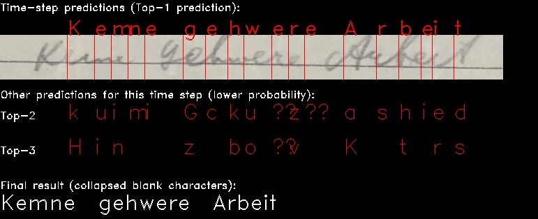
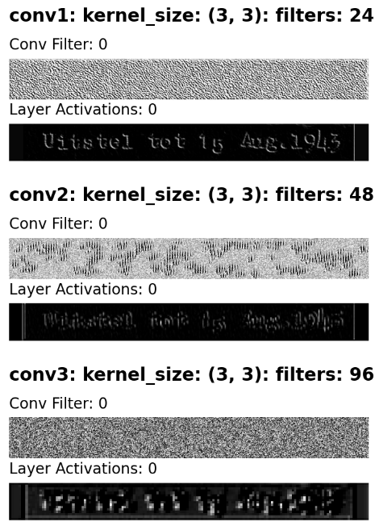

# Loghi-core HTR

Loghi HTR is a system to generate text from images. It's part of the Loghi framework, which consists of several tools for layout analysis and HTR (Handwritten Text Recogntion).

Loghi HTR also works on machine printed text.

## Table of Contents

1. [Installation](#installation)
2. [Usage](#usage)
3. [Variable-size Graph Specification Language (VGSL)](#variable-size-graph-specification-language-vgsl)
4. [API Usage Guide](#api-usage-guide)
5. [Model Visualizer Guide](#model-visualizer-guide)
6. [Frequently Asked Questions (FAQ)](#FAQ)

## Installation

This section provides a step-by-step guide to installing Loghi HTR and its dependencies.

### Prerequisites

Ensure you have the following prerequisites installed or set up:

- Ubuntu or a similar Linux-based operating system. The provided commands are tailored for such systems.

> [!IMPORTANT]
> The requirements listed in `requirements.txt` require a Python version > 3.9. This `tensorflow` version requires a Python version <= 3.11.

### Steps

1. **Install Python 3**

```bash
sudo apt-get install python3
```

2. **Clone and install CTCWordBeamSearch**

```bash
git clone https://github.com/githubharald/CTCWordBeamSearch
cd CTCWordBeamSearch
python3 -m pip install .
```

3. **Clone the HTR repository and install its requirements**

```bash
git clone https://github.com/knaw-huc/loghi-htr.git
cd loghi-htr
python3 -m pip install -r requirements.txt
```

With these steps, you should have Loghi HTR and all its dependencies installed and ready to use.

## Usage

### Setting Up

1. **(Optional) Organize Text Line Images**

    While not mandatory, for better organization, you can place your text line images in a 'textlines' folder or any desired location. The crucial point is that the paths mentioned in 'lines.txt' should be valid and point to the respective images.

2. **Generate a 'lines.txt' File**

    This file should contain the locations of the image files and their respective transcriptions. Separate each location and transcription with a tab.

Example of 'lines.txt' content:

```
/path/to/texline/1.png  This is a ground truth transcription
/path/to/texline/2.png  It can be generated from PageXML
/path/to/texline/3.png  And another textline
```

### Command-Line Options and Config File Usage

Our tool provides various command-line options for stages such as training, validation, and inference. To simplify usage, especially for newcomers, we've introduced the option to run the script with a configuration file.

#### Using a Config File

Instead of using command-line arguments, you can specify parameters in a JSON configuration file. This is recommended for ease of use. To use a configuration file, run the script with:

```
python3 main.py --config_file "/path/to/config.json"
```

In the `configs` directory, we provide several minimal configuration files tailored to different use cases:

- `default.json`: Contains default values for general use.
- `training.json`: Configured specifically for training.
- `validation.json`: Optimized for validation tasks.
- `inference.json`: Set up for inference processes.
- `testing.json`: Suitable for testing scenarios.
- `finetuning.json`: Adjusted for fine-tuning purposes.

These files are designed to provide a good starting point. You can use and modify them as needed.

#### Overriding Config File Parameters with Command-Line Arguments

You can override specific config file parameters with command-line arguments. For example:

```
python3 main.py --config_file "/path/to/config.json" --gpu 1
```

This command will use settings from the config file but overrides the GPU setting to use GPU 1.

#### Available Command-Line Options

You can still use command-line arguments. Some of the options include `--train_list`, `--do_validate`, `--learning_rate`, `--gpu`, `--batch_size`, `--epochs`, etc. For a full list and descriptions, refer to the help command:

```
python3 main.py --help
```

#### Note

Ensure that the parameters (via config file or command-line arguments) are consistent and appropriate for your operation mode (training, validation, or inference).

## Variable-size Graph Specification Language (VGSL)

Variable-size Graph Specification Language (VGSL) is a powerful tool that enables the creation of TensorFlow graphs, comprising convolutions and LSTMs, tailored for variable-sized images. This concise definition string simplifies the process of defining complex neural network architectures. For a detailed overview of VGSL, also refer to the [official documentation](https://github.com/mldbai/tensorflow-models/blob/master/street/g3doc/vgslspecs.md).

**Disclaimer:** _The base models provided in the `VGSLModelGenerator.model_library` were only tested on pre-processed HTR images with a height of 64 and variable width._

### How VGSL works

VGSL operates through short definition strings. For instance:

`None,64,None,1 Cr3,3,32 Mp2,2,2,2 Cr3,3,64 Mp2,2,2,2 Rc Fc64 D20 Lrs128 D20 Lrs64 D20 O1s92`

In this example, the string defines a neural network with input layers, convolutional layers, pooling, reshaping, fully connected layers, LSTM and output layers. Each segment of the string corresponds to a specific layer or operation in the neural network. Moreover, VGSL provides the flexibility to specify the type of activation function for certain layers, enhancing customization.

### Supported Layers and Their Specifications

| **Layer**          | **Spec**                                       | **Example**      | **Description**                                                                                                                                   |
|--------------------|------------------------------------------------|------------------|---------------------------------------------------------------------------------------------------------------------------------------------------|
| Input              | `batch,height,width,depth`                     | `None,64,None,1` | Input layer with variable batch_size & width, depth of 1 channel                                                                                  |
| Output             | `O(2\|1\|0)(l\|s)`                             | `O1s10`          | Dense layer with a 1D sequence as with 10 output classes and softmax                                                                              |
| Conv2D             | `C(s\|t\|r\|e\|l\|m),<x>,<y>[<s_x>,<s_y>],<d>` | `Cr3,3,64`       | Conv2D layer with Relu, a 3x3 filter, 1x1 stride and 64 filters                                                                                   |
| Dense (FC)         | `F(s\|t\|r\|l\|m)<d>`                          | `Fs64`           | Dense layer with softmax and 64 units                                                                                                             |
| LSTM               | `L(f\|r)[s]<n>,[D<rate>,Rd<rate>]`             | `Lf64`           | Forward-only LSTM cell with 64 units                                                                                                              |
| GRU                | `G(f\|r)[s]<n>,[D<rate>,Rd<rate>]`             | `Gr64`           | Reverse-only GRU cell with 64 units                                                                                                               |
| Bidirectional      | `B(g\|l)<n>[D<rate>Rd<rate>]`                  | `Bl256`          | Bidirectional layer wrapping a LSTM RNN with 256 units                                                                                            |
| BatchNormalization | `Bn`                                           | `Bn`             | BatchNormalization layer                                                                                                                          |
| MaxPooling2D       | `Mp<x>,<y>,<s_x>,<s_y>`                        | `Mp2,2,1,1`      | MaxPooling2D layer with 2x2 pool size and 1x1 strides                                                                                             |
| AvgPooling2D       | `Ap<x>,<y>,<s_x>,<s_y>`                        | `Ap2,2,2,2`      | AveragePooling2D layer with 2x2 pool size and 2x2 strides                                                                                         |
| Dropout            | `D<rate>`                                      | `D25`            | Dropout layer with `dropout` = 0.25                                                                                                               |
| Reshape            | `Rc`                                           | `Rc`             | Reshape layer returns a new (collapsed) tf.Tensor with a different shape based on the previous layer outputs                                      |
| ResidualBlock      | `RB[d]<x>,<y>,<z>`                             | `RB3,3,64`       | Residual Block with optional downsample. Has a kernel size of <x>,<y> and a depth of <z>. If `d` is provided, the block will downsample the input |

### Layer Details
#### Input

- **Spec**: `batch,height,width,depth`
- **Description**: Represents the input layer in TensorFlow, based on standard TF tensor dimensions.
- **Example**: `None,64,None,1` creates a `tf.layers.Input` with a variable batch size, height of 64, variable width and a depth of 1 (input channels)

#### Output

- **Spec**: `O(2|1|0)(l|s)<n>`
- **Description**: Output layer providing either a 2D vector (heat) map of the input (`2`), a 1D sequence of vector values (`1`) or a 0D single vector value (`0`) with `n` classes. Currently, only a 1D sequence of vector values is supported. 
- **Example**: `O1s10` creates a Dense layer with a 1D sequence as output with 10 classes and softmax.

#### Conv2D

- **Spec**: `C(s|t|r|e|l|m)<x>,<y>[,<s_x>,<s_y>],<d>`
- **Description**: Convolutional layer using a `x`,`y` window and `d` filters. Optionally, the stride window can be set with (`s_x`, `s_y`).
- **Examples**: 
  - `Cr3,3,64` creates a Conv2D layer with a Relu activation function, a 3x3 filter, 1x1 stride, and 64 filters.
  - `Cr3,3,1,3,128` creates a Conv2D layer with a Relu activation function, a 3x3 filter, 1x3 strides, and 128 filters.

#### Dense (Fully-connected layer)

- **Spec**: `F(s|t|r|e|l|m)<d>`
- **Description**: Fully-connected layer with `s|t|r|e|l|m` non-linearity and `d` units.
- **Example**: `Fs64` creates a FC layer with softmax non-linearity and 64 units.

#### LSTM

- **Spec**: `L(f|r)[s]<n>[,D<rate>,Rd<rate>]`
- **Description**: LSTM cell running either forward-only (`f`) or reversed-only (`r`), with `n` units. Optionally, the `rate` can be set for the `dropout` and/or the `recurrent_dropout`, where `rate` indicates a percentage between 0 and 100.
- **Example**: `Lf64` creates a forward-only LSTM cell with 64 units.

#### GRU

- **Spec**: `G(f|r)[s]<n>[,D<rate>,Rd<rate>]`
- **Description**: GRU cell running either forward-only (`f`) or reversed-only (`r`), with `n` units. Optionally, the `rate` can be set for the `dropout` and/or the `recurrent_dropout`, where `rate` indicates a percentage between 0 and 100.
- **Example**: `Gf64` creates a forward-only GRU cell with 64 units.

#### Bidirectional

- **Spec**: `B(g|l)<n>[,D<rate>,Rd<rate>]`
  - **Description**: Bidirectional layer wrapping either a LSTM (`l`) or GRU (`g`) RNN layer, running in both directions, with `n` units. Optionally, the `rate` can be set for the `dropout` and/or the `recurrent_dropout`, where `rate` indicates a percentage between 0 and 100.
- **Example**: `Bl256` creates a Bidirectional RNN layer using a LSTM Cell with 256 units.

#### BatchNormalization

- **Spec**: `Bn`
- **Description**: A technique often used to standardize the inputs to a layer for each mini-batch. Helps stabilize the learning process.
- **Example**: `Bn` applies a transformation maintaining mean output close to 0 and output standard deviation close to 1.

#### MaxPooling2D

- **Spec**: `Mp<x>,<y>,<s_x>,<s_y>`
- **Description**: Downsampling technique using a `x`,`y` window. The window is shifted by strides `s_x`, `s_y`.
- **Example**: `Mp2,2,2,2` creates a MaxPooling2D layer with pool size (2,2) and strides of (2,2).

#### AvgPooling2D

- **Spec**: `Ap<x>,<y>,<s_x>,<s_y>`
- **Description**: Downsampling technique using a `x`,`y` window. The window is shifted by strides `s_x`, `s_y`.
- **Example**: `Ap2,2,2,2` creates an AveragePooling2D layer with pool size (2,2) and strides of (2,2).

#### Dropout

- **Spec**: `D<rate>`
- **Description**: Regularization layer that sets input units to 0 at a rate of `rate` during training. Used to prevent overfitting.
- **Example**: `D50` creates a Dropout layer with a dropout rate of 0.5 (`D`/100).

#### Reshape

- **Spec**: `Rc`
- **Description**: Reshapes the output tensor from the previous layer, making it compatible with RNN layers.
- **Example**: `Rc` applies a specific transformation: `layers.Reshape((-1, prev_layer_y * prev_layer_x))`.

#### ResidualBlock
- **Spec**: `RB[d]<x>,<y>,<z>`
- **Description**: A Residual Block with a kernel size of <x>,<y> and a depth of <z>. If [d] is provided, the block will downsample the input. Residual blocks are used to allow for deeper networks by adding skip connections, which helps in preventing the vanishing gradient problem.
- **Example**: `RB3,3,64` creates a Residual Block with a 3x3 kernel size and a depth of 64 filters.

## API Usage Guide

This guide walks you through the process of setting up and running the API, as well as how to interact with it.

### 1. Setting up the API

Navigate to the `src/api` directory in your project:

```bash
cd src/api
```

#### Starting the API

You have the choice to run the API using either `gunicorn` (recommended) or `flask`. To start the server:

Using `gunicorn`:

```bash
gunicorn 'app:create_app()'
```

#### Environment Variables Configuration

Before running the app, you must set several environment variables. The app fetches configurations from these variables:

**Gunicorn Options:**

```bash
GUNICORN_RUN_HOST        # Default: "127.0.0.1:8000": The host and port where the API should run.
GUNICORN_ACCESSLOG       # Default: "-": Access log settings.
```

**Loghi-HTR Options:**

```bash
LOGHI_MODEL_PATH         # Path to the model.
LOGHI_BATCH_SIZE         # Default: "256": Batch size for processing.
LOGHI_OUTPUT_PATH        # Directory where predictions are saved.
LOGHI_MAX_QUEUE_SIZE     # Default: "10000": Maximum size of the processing queue.
LOGHI_PATIENCE           # Default: "0.5": Maximum time to wait for new images before predicting current batch
```

**Important Note:** The `LOGHI_MODEL_PATH` must include a `config.json` file that contains at least the `channels` key, along with its corresponding model value. This file is expected to be automatically generated during the training or fine-tuning process of a model. Older versions of Loghi-HTR (< 1.2.10) did not do this automatically, so please be aware that our `generic-2023-02-15` model lacks this file by default and is configured to use 1 channel.

**GPU Options:**

```bash
LOGHI_GPUS               # Default: "0": GPU configuration.
```

**Security Options:**

```bash
SECURITY_ENABLED         # Default: "false": Enable or disable API security.
SECURITY_KEY_USER_JSON   # JSON string with API key and associated user data.
```

You can set these variables in your shell or use a script. An example script to start a `gunicorn` server can be found in `src/api/start_local_app.sh` or `src/api/start_local_app_with_security.sh` for using security.

### 2. Interacting with the running API

Once the API is up and running, you can send HTR requests using curl. Here's how:

```bash
curl -X POST -F "image=@$input_path" -F "group_id=$group_id" -F "identifier=$filename" http://localhost:5000/predict
```

Replace `$input_path`, `$group_id`, and `$filename` with your respective file paths and identifiers. If you're considering switching the recognition model, use the `model` field cautiously:

- The `model` field (`-F "model=$model_path"`) allows for specifying which handwritten text recognition model the API should use for the current request. 
- To avoid the slowdown associated with loading different models for each request, it is preferable to set a specific model before starting your API by using the `LOGHI_MODEL_PATH` environment variable.
- Only use the `model` field if you are certain that a different model is needed for a particular task and you understand its performance characteristics.

> [!WARNING]
> Continuous model switching with `$model_path` can lead to severe processing delays. For most users, it's best to set the `LOGHI_MODEL_PATH` once and use the same model consistently, restarting the API with a new variable only when necessary.

Optionally, you can add `"whitelist="` fields to add extra metadata to your output. The field values will be used as keys to lookup values in the model config.

**Security and Authentication:**

If security is enabled, you need to first authenticate by obtaining a session key. Use the `/login` endpoint with your API key:

```bash
curl -v -X POST -H "Authorization: Bearer <your_api_key>" http://localhost:5000/login
```

Your session key will be returned in the header of the response. Once authenticated, include the received session key in the Authorization header for all subsequent requests:

```bash
curl -X POST -H "Authorization: Bearer <your_session_key>" -F "image=@$input_path" ... http://localhost:5000/predict
```

### 3. Server Health Check

To check the health of the server, simply run:

```bash
curl http://localhost:5000/health
```

This will respond with a 500 error, and an "unhealthy" status if one of the processes has crashed. Otherwise, it will respond with a 200 error, and a corresponding "healthy" status.

---

This guide should help you get started with the API. For advanced configurations or troubleshooting, please reach out for support.

## Model Visualizer Guide

The following instructions will explain how to generate visualizations that can help describe an existing model's learned representations when provided with a sample image. The visualizer requires a trained model and a sample image (e.g. PNG or JPG):

<figure>
  
  <figcaption>Fig.1 - Time-step Prediction Visualization.</figcaption>
</figure>

<figure>
  
  <figcaption>Fig.2 - Convolutional Layer Activation Visualization.</figcaption>
</figure>

### 1. Visualize setup
Navigate to the `src/visualize` directory in your project:

```bash
cd src/visualize
```

### 2. Start the visualizers

```bash
python3 main.py 
--model /path/to/existing/model 
--sample_image /path/to/sample/img
```

This will output various files into the `visualize_plots directory`:
* A PDF sheet consisting of all made visualizations for the above call
* Individual PNG and JPG files of these visualizations
* A `sample_image_preds.xslx` which consist of a character prediction table for 
  each prediction timestep. The highest probability is the character that was chosen by the model

Currently, the following visualizers are implemented:
1. **visualize_timestep_predictions**: Takes the `sample_image` and simulates the model's prediction process for each time step, the top-3 most probable characters per timestep are displayed and the "cleaned" result is shown at the bottom.
2. **visualize_filter_activations**: Display what the convolutional filters have learned after providing it with random noise + show the activation of conv filters for the `sample_image`. Each unique convolutional layer is displayed once.

Potential future implementations:
* Implement a SHAP visualizer to show the parts of the image that influence the model's character prediction. Or a similar saliency plot.
* Plot the raw Conv filters (e.g. a 3x3 filter)

**Note**:  If a model has multiple `Cr3,3,64` layers then only the first instance of this configuration is visualized)

### 3. (Optional parameters)
```bash
--do_detailed # Visualize all convolutional layers, not just the first instance of a conv layer
--dark_mode  # Plots and overviews are shown in dark mode (instead of light mode)
--num_filters_per_row # Changes the number of filters per row in the filter activation plots (default =6)
# NOTE: increasing the num_filters_per_row requires significant computing resources, you might experience an OOM.
```

---

## FAQ

If you're new to using this tool or encounter issues, this FAQ section provides answers to common questions and problems. If you don't find your answer here, please reach out for further assistance.

### How Can I Use One of the Loghi HTR Models in My Own Project?

To integrate a Loghi HTR model into your project, follow these steps:

1. **Obtain the Model**: First, you need to get the HTR model file. This could be done by training a model yourself or downloading a pre-trained model [here](https://images.diginfra.net/pim/loghihtrmodels) or [here](https://surfdrive.surf.nl/files/index.php/s/YA8HJuukIUKznSP?path=%2Floghi-htr).

2. **Loading the Model for Inference**: 
    - Install TensorFlow in your project environment if you haven't already.
    - Load the model using TensorFlow's `tf.keras.models.load_model` function. Here's a basic code snippet to help you get started:

      ```python
      import tensorflow as tf

      model_file = 'path_to_your_model.keras'  # Replace with your model file path
      model = tf.keras.models.load_model(model_file, compile=False)
      ```

    - Setting `compile=False` is crucial as it indicates the model is being loaded for inference, not training.

3. **Using the Model for Inference**: 
    - Once the model is loaded, you can use it to make predictions on handwritten text images.
    - Prepare your input data (images of handwritten text) according to the model's expected input format.
    - Use the `model.predict()` method to get the recognition results.

4. **Note on Training**: 
    - The provided model is pre-trained and configured for inference purposes.
    - If you wish to retrain or fine-tune the model, this must be done within the Loghi framework, as the model structure and training configurations are tailored to their system.

### How can I determine the VGSL spec of a model I previously used?

If you've used one of our older models and would like to know its VGSL specification, follow these steps:

**For Docker users:**

1. If your Docker container isn't already running with the model directory mounted, start it and bind mount your model directory:

```bash
docker run -it -v /path/on/host/to/your/model_directory:/path/in/container/to/model_directory loghi/docker.htr
```

Replace `/path/on/host/to/your/model_directory` with the path to your model directory on your host machine, and `/path/in/container/to/model_directory` with the path where you want to access it inside the container.

2. Once inside the container, run the VGSL spec generator:

```bash
python3 /src/loghi-htr/src/model/vgsl_model_generator.py --model_dir /path/in/container/to/model_directory
```

Replace `/path/in/container/to/model_directory` with the path you specified in the previous step.

**For Python users:**

1. Run the VGSL spec generator:

```bash
python3 src/model/vgsl_model_generator.py --model_dir /path/to/your/model_directory
```

Replace `/path/to/your/model_directory` with the path to the directory containing your saved model.

### How do I use `replace_recurrent_layer`?

The `replace_recurrent_layer` is a feature that allows you to replace the recurrent layers of an existing model with a new architecture defined by a VGSL string. To use it:

1. Specify the model you want to modify using the `--model` argument.
2. Provide the VGSL string that defines the new recurrent layer architecture with the `--replace_recurrent_layer` argument. The VGSL string describes the type, direction, and number of units for the recurrent layers. For example, "Lfs128 Lfs64" describes two LSTM layers with 128 and 64 units respectively, with both layers returning sequences.
3. Execute your script or command, and the tool will replace the recurrent layers of your existing model based on the VGSL string you provided.

### I'm getting the following error when I want to use `replace_recurrent_layer`: `Input 0 of layer "lstm_1" is incompatible with the layer: expected ndim=3, found ndim=2.` What do I do?

This error usually indicates that there is a mismatch in the expected input dimensions of the LSTM layer. Often, this is because the VGSL spec for the recurrent layers is missing the `[s]` argument, which signifies that the layer should return sequences.

To resolve this:
- Ensure that your VGSL string for the LSTM layer has an `s` in it, which will make the layer return sequences. For instance, instead of "Lf128", use "Lfs128".
- Re-run the script or command with the corrected VGSL string.
